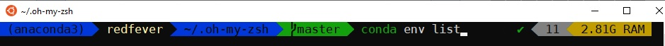

# WSL-Beautifier
this script perform ZSH installation on Ubuntu 18.04,20.4,20.10,21.04 and perform additional post configuration to improve end user experience and installs :
**Powerline,Powerlevel9k,Syntax Highlighting,Git,Autosuggestions,Oh My ZSH**
<h2 align="center" id="WSL-Beautifier">
	
</h2>

## Installation

### 1.Running the script :
```sh
sudo bash -c  "$(wget -qO- https://git.io/J0Tr6)"
```
### 2.Fixing ~/.zshrc and close terminal :
```sh
sudo bash  ~/.fixzsh.sh
```
### 3.Open Terminal again and change defult font to the :
```
[ DejaVu Sans Mono Bold for Powerline ]
```
<h2 align="center" id="font-properties">
	
</h2>