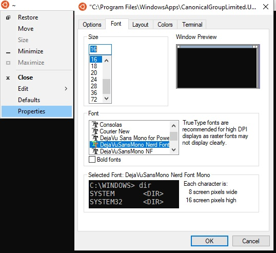

# WSL-Beautifier


## Installation

### 1.Running the script :
```sh
sudo bash -c  "$(wget -qO- https://git.io/J0Tr6)"
```
### 2.Fixing ~/.zshrc and close terminal :
```sh
sudo bash  ~/.fixzsh.sh
```
### 3.Open Terminal again and change defult font to the :
```
[ DejaVu Sans Mono Bold for Powerline ]
```
<h2 align="center" id="font-properties">
	
</h2>