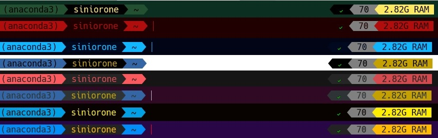

# WSL-Beautifier
this script perform ZSH installation on Ubuntu 18.04,20.4,20.10,21.04 and perform additional post configuration to improve end user experience and installs :
**Powerline,Powerlevel9k,Syntax Highlighting,Git,Autosuggestions,Oh My ZSH and 40 schemes from iTerm2-Color-Schemes**
<h2 align="center" id="WSL-Beautifier">
	
</h2>

## Installation

### 1.Running the script :
```sh
 bash -c  "$(wget -qO- https://git.io/J0Tr6)"
```
### 2.Close and Open WSL again and change defult font to the :

change the font to the:
[ DejaVu Sans Mono Nerd Font Complete ] or [Hack Regular Nerd Font Complete]

<h2 align="center" id="font-properties">
	
</h2>

### 3.Open Windows Terminal and change Font and Scheme :
<h2 align="center" id="WSL-Schemes">
	
</h2>

Select your favourite scheme and change the font to the:
[ DejaVu Sans Mono Nerd Font Complete ] or [Hack Regular Nerd Font Complete]
<h2 align="center" id="windows-terminal-appearance">
	
</h2>


## Schemes ONLY installation:
if you installed all the packages before, you can just run this script to add around 40 schemes from iTerm2-Color-Schemes to your **Windows Terminal**:
```sh
bash -c  "$(wget -qO- https://git.io/J0g6c)"
```


