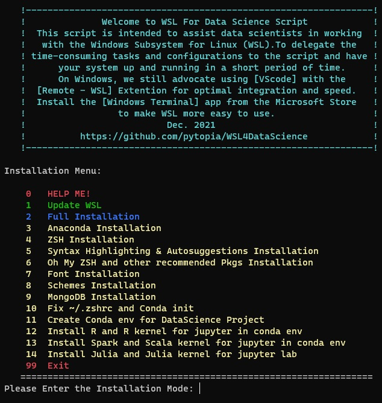

# WSL For Data Science 
<h2 align="center" id="WSL-Beautifier">
	
</h2>

## A. Running the script :

```sh
 bash -c  "$(wget -qO- https://git.io/JycKg)"
```
<h2 align="center" id="font-properties">
	
</h2>

### 1.Update WSL:
install available upgrades of all packages currently installed on the  system from the sources configured via sources.list file. New packages will be installed if required to satisfy dependencies, but existing packages will never be removed.

### 2.Full Installation:
This part installs all of the script's functionality on WSL.This feature is excellent for quickly establishing. an appropriate environment for data science activities.

### 3.Anaconda Installation:
Installs the most recent version of Anaconda, one of the most popular package managers for data science projects.

### 4.ZSH Installation:
ZSH is a powerful shell that can function as an interactive shell as well as a scripting language interpreter. It has many features similar to Bash, however some of ZSH's characteristics make it superior to Bash, such as spelling correction, cd automation,better theme and plugin support, and so on.

### 5.Syntax Highlighting & Autosuggestions Installation:
It enables highlighting of commands whilst they are typed at a zsh prompt into an interactive terminal. This helps in reviewing commands before running them, particularly in catching syntax errors. As you type commands, you will see a completion offered  after the cursor in a muted gray color. If you press the right-arrow key or End with the cursorat the end of the buffer, it will accept the suggestion,  replacing  the contents of  the command line buffer with the suggestion. If you invoke the forward-word  widget, it willpartially accept the suggestion up to the point that the cursor moves to.

### 6.Oh My ZSH and other recommended Pkgs Installation:
Oh My Zsh is a delightful, open source,community-driven framework for managing your Zsh configuration. It comes bundled with thousands of helpful functions, helpers,  plugins,  themes... . It also installs the Powerlevel9k and Powerline fonts.Powerlevel9k was a tool for building a beautiful and highly functional CLI, customized for you.

### 7.Font Installation:
This script will install two fonts on Windows: [**Hack Regular Nerd Font Complete.ttf**] and [**DejaVu Sans Mono Nerd Font Complete.ttf**] Enter the settings if you're using Windows Terminal. Choose your WSL profile.Set the Face Font option on the Appearance tab to one of the two fonts shown above.Font adjustments are required to effectively display WSL's features and capabilities.

### 8.Schemes Installation:
Downloads around 40 schemas from the Iterm 2 collection and adds them to the Windows Terminal settings. Before running this script, you must have Windows Terminal installed.

### 9.MongoDB Installation:
Due to the numerous issues encountered with  the  installation of MongoDB on WSL, this script attempts to install version 4.4 on WSL so  that  you  may  access  MongoDB  through  **127.0.0.1** and port **27017**. In addition, if you want  to  install  MongoDB on Windows and use it with WSL, a script will be added to your WSL at the `~/findmongo` path, and runs with this command:```$ source  ~/findmongo```.findmongo  displays  the  correct  host  and  port for MongoDB that installed on Windows. More information may be found in the README file of project.

### 10. Fix ~/.zshrc and Conda init:
This section enhances  ZSH command prompt, makes it compatible with Anaconda and Powerlevel9k, and adds Anaconda's default settings to ~/.zshrc  .

### 11.Create Conda env for DataScience Project:
In this section to provide a complete environment for data science activities a Python environment is created with the following packages and with your desired name:
```
             python=3.8 jupyterlab pandas
             numpy scipy matplotlib seaborn
             scikit-learn tensorflow keras plotly
             pytorch pymongo scrapy beautifulsoup4
```
### 99.Exit:
You can quit the script by typing the number 99 in the menu.
	     
## B. Close and Open WSL again and change defult font to the :

change the font to the:
[ DejaVu Sans Mono Nerd Font Complete ] or [Hack Regular Nerd Font Complete]

<h2 align="center" id="font-properties">
	
</h2>

## C. Open Windows Terminal and change Font and Scheme :
<h2 align="center" id="WSL-Schemes">
	
</h2>

Select your favourite scheme and change the font to the:
[ DejaVu Sans Mono Nerd Font Complete ] or [Hack Regular Nerd Font Complete]
<h2 align="center" id="windows-terminal-appearance">
	
</h2>


